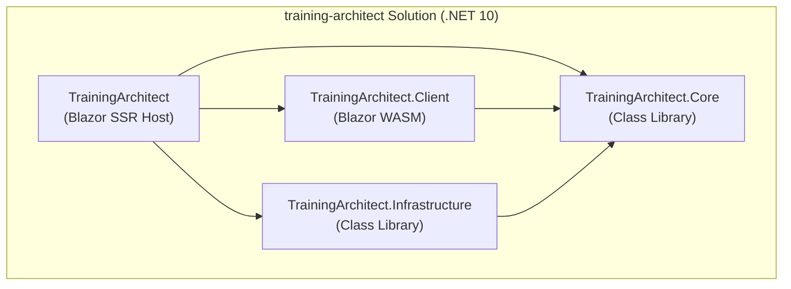

# Training Architect

*AI-powered cycling coach backed by intervals.icu*

Training Architect is a Blazor web application that connects to [intervals.icu](https://intervals.icu) and provides athletes with a personalised virtual coaching experience. A conversational AI coach analyses current fitness data (CTL, ATL, TSB) and proposes structured weekly training plans, which the athlete can accept, adjust, or reject directly in the app.

**Key capabilities:**

- **Virtual coach** — chat-based interface powered by an AI orchestration pipeline (Microsoft.Extensions.AI / Semantic Kernel)
- **intervals.icu integration** — reads athlete fitness data and workout library via the intervals.icu REST API
- **Structured plan proposals** — weekly training plans with day-by-day workouts including zone, TSS, IF, and coaching notes
- **Athlete confirmation flow** — Accept / Adjust / Reject without a full page reload; decision forwarded to the coaching agent
- **Azure-native** — Cosmos DB, Key Vault, Managed Identity, zero secrets stored anywhere
  - Key Vault for sensitive configuration — secrets loaded at startup via `AddAzureKeyVault()`, only in production
  - Application Insights for request tracking, dependency monitoring, and exception logging
- **Infrastructure as Code** — Bicep templates for all Azure resources
- **CI/CD with GitHub Actions** — automated deployment using OIDC Federated Credentials (no client secrets)

---

## Tech Stack

| Layer | Technology |
|---|---|
| Framework | [.NET 10 / Blazor Web App](https://dotnet.microsoft.com/en-us/apps/aspnet/web-apps/blazor) |
| Hosting | [Azure Web App (App Service)](https://learn.microsoft.com/en-us/azure/app-service/) |
| Database | [Azure Cosmos DB NoSQL](https://learn.microsoft.com/en-us/azure/cosmos-db/nosql/) |
| Authentication | [Microsoft Entra ID](https://learn.microsoft.com/en-us/entra/identity/) via [Microsoft.Identity.Web](https://github.com/AzureAD/microsoft-identity-web) |
| UI Components | [Syncfusion Blazor](https://www.syncfusion.com/blazor-components) (Community License) |
| CI/CD | [GitHub Actions](https://docs.github.com/en/actions) |
| Observability | Azure Application Insights + Log Analytics |

### Dependency Diagram



---

## Training Architect — UI Shell

The repository includes a scaffolded front-end for an AI-powered cycling coaching feature
("Training Architect"). All orchestration, agent calls, auth flows, and MCP integration are
**intentionally left as stubs** with `// TODO:` markers pointing to the integration contract.

### Pages

| Route | Render mode | Description |
|---|---|---|
| `/coach` | `InteractiveWebAssembly` | Coaching chat (message list + input); backed by `IChatService` |
| `/training-plan` | Static SSR + embedded WASM | Structured weekly plan viewer; athlete confirms via `PlanConfirmation` |
| `/dashboard` | `InteractiveWebAssembly` | CTL / ATL / TSB KPI cards and 28-day progression chart |

### Render-mode Strategy

```
Static SSR (default)
  └─ /training-plan  ← StreamRendering; IAuthContext resolved server-side
        └─ <PlanConfirmation rendermode="InteractiveWebAssembly" />
              Athlete can Accept / Adjust / Reject without a full page reload.
              Decision bubbles up via EventCallback → TODO: forward to agent.

InteractiveWebAssembly (minimal surface)
  ├─ /coach        ← IChatService scoped per WASM session
  └─ /dashboard    ← IIntervalsDataProvider returns sample fitness data
```

The WASM surface is kept minimal: only the two pages that require client-side reactivity
(`/coach` and `/dashboard`) run as full WASM circuits. The training-plan confirmation
component is an island of interactivity inside an otherwise SSR page.

### Orchestration Plug-in Points

Replace each stub in `TrainingArchitect.Core/Services/` with the real implementation and
re-register it in `TrainingArchitect/Program.cs` (server) and
`TrainingArchitect.Client/Program.cs` (WASM).

| Interface | Stub | Integration point |
|---|---|---|
| `IChatService` | `StubChatService` | Call the .NET orchestration pipeline (e.g. `Microsoft.Extensions.AI` / Semantic Kernel agent graph) |
| `IAuthContext` | `StubAuthContext` | Read OIDC subject claim from `IHttpContextAccessor`; resolve `AthleteTier` from entitlement store — **never from client input** |
| `IIntervalsDataProvider` | `StubIntervalsDataProvider` | Call the intervals.icu REST API with the athlete's stored API key (retrieved server-side from Key Vault) |

### New Core Models

| Model | Purpose |
|---|---|
| `ChatMessage` | Single message in the conversation (`User` / `Assistant` roles) |
| `TrainingPlan` | Weekly plan with ordered `PlannedWorkout` entries |
| `PlannedWorkout` | Day, title, type, duration, TSS, IF, zone, coaching description |
| `AthleteProfile` | Athlete ID, display name, `AthleteTier` (resolved server-side) |
| `AthleteSnapshot` | Current CTL / ATL / TSB and `FitnessPoint` history from intervals.icu |
| `PlanDecision` | Athlete's verdict on a proposed plan (`Accepted` / `AdjustmentRequested` / `Rejected`) |

---

## Architecture Decisions

### Render Modes

- **Static SSR** is the default render mode for all public pages (`/`, `/projects`, `/articles`, `/articles/{slug}`). This ensures fast initial load times and full SEO indexability without JavaScript requirements. All public pages include full SEO meta tags: title, description, Open Graph (`og:*`), article tags, and canonical URLs. Article detail pages use the article's own title and summary for dynamic meta tags.
- **InteractiveWebAssembly** is used for admin edit pages (`/admin/about`, `/admin/projects`, `/admin/articleeditor/{id?}`, `/admin/legal`) that require Syncfusion Grid and Rich Text Editor interactivity. These pages live in the `TrainingArchitect.Client` Blazor WebAssembly project and are served by the host server. Data is fetched via minimal API endpoints (`/api/about`, `/api/projects`, `/api/articles`) that require the `SiteAdmin` role.

### Owner-Only Editing

There is no separate admin user database. The site owner is identified by the **`SiteAdmin` App Role** assigned in the Entra ID Enterprise Application. The role is checked on every request server-side via `IOwnerService` — UI visibility alone is never relied upon.

Define the app role once in **Entra ID → App registrations → your app → App roles → Create app role** with these values:

- Display name: `Site Administrator`
- Allowed member types: `Users/Groups`
- Value: `SiteAdmin`
- Description: `Users in this group have admin rights.`
- Do you want to enable this app role?: `Yes`

```
User logs in via Entra ID
       ↓
App Role claims included in token
       ↓
IOwnerService.IsOwner() checks user.IsInRole("SiteAdmin")
       ↓
IsOwner cascaded as bool to all Blazor components
```

To grant access: **Entra ID → Enterprise Applications → your app → Users and groups → Add user/group → assign role `Site Administrator`**.

Important: the application authorization check uses the role **value** (`SiteAdmin`) in the token claim, not the display name.

### Legal Content Management

The legal page (`/legal`) is no longer populated from configuration values.
Legal content is now managed as online content and edited in the admin UI at `/admin/legal`.

- Source of truth: persisted content in Cosmos DB (about document)
- Editing: protected admin workflow (`SiteAdmin` role required)
- Not used for legal content: `config.ps1`, `appsettings*.json`, or Key Vault settings

### Observability

Application Insights is configured with a Log Analytics workspace backend.
Telemetry is collected automatically for:
- All HTTP requests (Static SSR and API endpoints)
- Dependency calls (Cosmos DB, Key Vault, Azure Storage)
- Exceptions and failed requests
- Performance metrics

The connection string is stored in App Service configuration
(`APPLICATIONINSIGHTS_CONNECTION_STRING`) — not a secret,
safe to store as an App Setting.

Locally, Application Insights telemetry is disabled by default
unless `APPLICATIONINSIGHTS_CONNECTION_STRING` is set in user-secrets.

### Data Model

All content is stored in a single Cosmos DB container (`content`) with a `type` field as logical partition:

| type | Description |
|---|---|
| `about` | Single document, id = `about` |
| `article` | One document per article, partition key = `article` |
| `project` | One document per project, partition key = `project` |

---

## Project Structure

```
training-architect.slnx
infra/
├── main.bicep                      # Entry point — orchestrates all modules
├── main.bicepparam                 # Production parameter values
├── main.local.bicepparam           # Local parameter values (gitignored)
└── modules/
    ├── app-service.bicep           # App Service Plan + Linux Web App (.NET 10)
    ├── appinsights.bicep           # Application Insights + Log Analytics workspace
    ├── cosmos.bicep                # Cosmos DB account, database, container
    ├── cosmos-rbac.bicep           # Cosmos DB Built-in Data Contributor → Web App identity
    ├── custom-domain.bicep         # Apex + www hostname bindings
    ├── custom-domain-ssl.bicep     # Free managed SSL certificate for www subdomain
    ├── keyvault.bicep              # Key Vault
    ├── keyvault-rbac.bicep         # KV Certificate User + Secrets User → Web App identity
    ├── storage.bicep               # Storage Account + article-images blob container
    └── storage-rbac.bicep          # Storage Blob Data Contributor → Web App identity
src/
├── TrainingArchitect/             # Blazor Web App host (SSR + API)
│   ├── Components/
│   │   ├── Layout/             # NavMenu, MainLayout
│   │   └── Pages/              # Public pages (Static SSR)
│   ├── Endpoints/              # Minimal API endpoints for admin data
│   │   ├── AboutEndpoints.cs
│   │   ├── ArticleEndpoints.cs
│   │   └── ProjectEndpoints.cs
│   ├── Models/
│   │   └── UserInfo.cs         # DTO for /api/user (auth state for WASM)
│   └── Program.cs
├── TrainingArchitect.Client/      # Blazor WebAssembly client (admin pages)
│   ├── Pages/Admin/            # Admin edit pages (InteractiveWebAssembly)
│   │   ├── AboutEditor.razor
│   │   ├── ArticleEditor.razor
│   │   └── Projects.razor
│   ├── Services/
│   │   ├── ApiAuthenticationStateProvider.cs  # Calls /api/user
│   │   ├── HttpAboutRepository.cs
│   │   ├── HttpArticleRepository.cs
│   │   └── HttpProjectRepository.cs
│   └── Program.cs
├── TrainingArchitect.Core/        # Domain layer (no infrastructure dependencies)
│   ├── Interfaces/
│   │   ├── IRepository.cs          # Generic base repository interface
│   │   ├── IArticleRepository.cs
│   │   ├── IProjectRepository.cs
│   │   ├── IAboutRepository.cs
│   │   └── IOwnerService.cs
│   ├── Models/
│   │   ├── CosmosDocument.cs       # Base class for all Cosmos DB documents
│   │   ├── Article.cs
│   │   ├── Project.cs
│   │   ├── AboutContent.cs
│   │   └── ProfileLink.cs
│   └── Services/
│       └── OwnerService.cs
└── TrainingArchitect.Infrastructure/  # Data access layer (Cosmos DB)
    └── Repositories/
        ├── CosmosRepository.cs     # Generic base repository (Cosmos DB SDK)
        ├── ArticleRepository.cs
        ├── ProjectRepository.cs
        └── AboutRepository.cs
```

Public pages use Static SSR and depend only on `Core` interfaces, served from Cosmos DB via `Infrastructure`. Admin pages run as WebAssembly in `TrainingArchitect.Client` and call the host server's minimal API endpoints — all protected by the `SiteAdmin` role.

---

## Initial Setup (once per project)

Before GitHub Actions can deploy infrastructure and code, a one-time manual setup is required to bootstrap the deployment identity and permissions.

### 1. Create Resource Group
```bash
az group create \
  --name <resource-group-name> \
  --location <location>
```

### 2. Create Deployment Service Principal

Use `Create-ServicePrincipalForDeployment.ps1` from [cloud-admin-toolkit](https://github.com/rbrands/cloud-admin-toolkit):
```powershell
.\Create-ServicePrincipalForDeployment.ps1 -ConfigName <project-name>
```
This script also assigns **Contributor** and **User Access Administrator** roles on the target resource group.

If your deployment spans both an app resource group and a shared central resource group (for example Cosmos DB in the central group), run the command twice with the resource-group parameter:

```powershell
# App resource group
.\Create-ServicePrincipalForDeployment.ps1 -ConfigName <project-name> -ResourceGroupName <app-resource-group>

# Central/shared resource group
.\Create-ServicePrincipalForDeployment.ps1 -ConfigName <project-name> -ResourceGroupName <central-resource-group>
```

Without permissions on both groups, infrastructure deployment can fail when templates reference existing shared resources in the central group.

### 3. Add OIDC Federated Credential

Use `Add-FederatedCredentialForGitHub.ps1` from [cloud-admin-toolkit](https://github.com/rbrands/cloud-admin-toolkit):
```powershell
.\Add-FederatedCredentialForGitHub.ps1 -ConfigName <project-name>
```

After this step no client secret is stored anywhere. OIDC handles authentication via GitHub's identity provider.

### 4. Create App Registration with Certificate

Use `Create-AppRegistrationWithCertificate.ps1` from [cloud-admin-toolkit](https://github.com/rbrands/cloud-admin-toolkit):
```powershell
.\Create-AppRegistrationWithCertificate.ps1 -ConfigName <project-name>
```

This creates the Entra ID App Registration for user authentication and generates a self-signed certificate.

After the script completes, copy the **Application (client) ID** from the output and set it in `config.ps1`:
```powershell
ClientId = "<application-client-id>"
```

Configure Redirect URIs in Entra ID:

- Azure Portal: Entra ID → App registrations → your app → Authentication → Add a platform → Web
- Add each environment URI that can receive sign-in callbacks:
  - `https://localhost:7000/signin-oidc`
  - `https://training-architect-dev.azurewebsites.net/signin-oidc`
  - `https://training-architect-staging.azurewebsites.net/signin-oidc`
  - `https://training-architect.azurewebsites.net/signin-oidc`
  - `https://training-architect.com/signin-oidc` (optional, custom domain)

Only keep URIs for environments you actually use. Unused redirect URIs should be removed.

### 5. Configure and Run Setup Script
```powershell
# Copy and fill in all values
cp config.example.ps1 config.ps1

# Set dotnet user-secrets, GitHub Secrets, and generate
# main.local.bicepparam in one step
.\setup.ps1 -All
```

### 6. CI/CD flow (after first push)

```bash
git push origin main
```

deploy-infrastructure.yml creates:

- Key Vault
- Cosmos DB account, database, container
- Storage Account with article-images container
- App Service Plan + Web App
- All RBAC role assignments (Managed Identity)

Application deployment flow:

- Pull request to `main` deploys app changes to slot `dev`.
- Push to `main` deploys app changes to slot `staging`.
- Production is promoted only via manual workflow `swap-staging-to-production.yml` (swap `staging` -> `production`).

This makes `staging` the only release source for `production`.

### 7. Upload Certificate to Key Vault (one-time manual step)

After the first infrastructure deployment, upload the certificate:
Azure Portal → <key-vault-name> → Certificates → Generate/Import → Import
→ Upload the .pem file generated by Create-AppRegistrationWithCertificate.ps1
→ Certificate name must match CERT_NAME in config.ps1

This is the only step that cannot be automated — storing the private key in CI/CD would defeat the purpose of using Key Vault.

### 7a. Set Key Vault Secrets

Assign the **Key Vault Secrets Officer** role to your account using `Set-KeyVaultRoleAssignment.ps1` from cloud-admin-toolkit, then run:

```powershell
.\setup.ps1 -KeyVault
```

Secrets stored in Key Vault:

| Secret name | Maps to config key |
|---|---|
| `Syncfusion--LicenseKey` | `Syncfusion:LicenseKey` |

> **Note:** Key Vault secret names use `--` as a separator, which Azure App Configuration maps to `:` in .NET configuration.

### 8. Trigger final deployment

After uploading the certificate, trigger a new deployment:
```bash
git commit --allow-empty -m "chore: trigger deployment after certificate upload"
git push origin main
```

The application is now fully deployed and operational.

---

> **What is manual vs automated:**
>
> | Step | How |
> |---|---|
> | Resource Group | Manual — az group create |
> | Service Principal + OIDC | cloud-admin-toolkit scripts |
> | App Registration + Certificate | cloud-admin-toolkit scripts |
> | All Azure resources (KV, Cosmos, Storage, App Service) | Bicep via GitHub Actions |
> | Certificate upload to Key Vault | Manual — one-time after first deployment |
> | Application deployment | GitHub Actions |
> | Configuration | setup.ps1 + config.ps1 |

## CI/CD

Two GitHub Actions workflows handle automated deployment:

| Workflow | Trigger | What it does |
|---|---|---|
| `deploy-app.yml` | PR to `main` or push to `main` when `src/**` changes | Builds the Blazor app and deploys by slot (`dev` for PRs, `staging` for `main` pushes) |
| `swap-staging-to-production.yml` | Manual (`workflow_dispatch`) | Runs pre-checks on `staging`, swaps `staging` to `production`, then runs post-checks on `production` |
| `deploy-infrastructure.yml` | Push to `main` when `infra/**` changes | Deploys Bicep templates to Azure |

Both workflows use **OIDC Federated Credentials** for authentication — no client secrets are stored in GitHub.

### Deployment Slots

The App Service is provisioned with two deployment slots:
- `dev`
- `staging`

Slot URLs:
- Dev: `https://<APP_NAME>-dev.azurewebsites.net`
- Staging: `https://<APP_NAME>-staging.azurewebsites.net`
- Production: `https://<APP_NAME>.azurewebsites.net` (or your custom domain)

Deployment and promotion flow (recommended):

```bash
# PR to main -> deploy to dev slot
# Push to main -> deploy to staging slot

# Promote staging -> production (manual approval point)
az webapp deployment slot swap \
  --resource-group <APP_RESOURCE_GROUP> \
  --name <APP_NAME> \
  --slot staging \
  --target-slot production
```

There is no `dev -> staging` swap in the standard flow.
`staging` is refreshed by direct deployment from `main`, and only `staging -> production` is swapped.

### Authentication Setup (OIDC)

1. Create a Service Principal using `Create-ServicePrincipalForDeployment.ps1` (see step 2 in [Initial Setup](#initial-setup-once-per-project))
2. Add a Federated Credential to the Service Principal:
   - **Issuer:** `https://token.actions.githubusercontent.com`
   - **Subject:** `repo:{org}/{repo}:ref:refs/heads/main`
   - **Audiences:** `api://AzureADTokenExchange`

See: https://docs.github.com/en/actions/concepts/security/openid-connect

> **How OIDC authentication works in the workflows:**
> The `AZURE_CLIENT_ID` secret identifies *which* Service Principal to authenticate as.
> The Federated Credential on that Service Principal then tells Azure *which* GitHub repo and branch it trusts.
> OIDC replaces the **client secret** — instead of a password, GitHub issues a short-lived signed token that Azure verifies against the Federated Credential. No secret is ever stored.

Scripts for creating the service principal and configuring the federated credential are available in [rbrands/cloud-admin-toolkit](https://github.com/rbrands/cloud-admin-toolkit).

### Required GitHub Secrets

All secrets are set automatically by `setup.ps1 -GitHub` (see [Initial Setup](#initial-setup-once-per-project), step 6). No manual configuration in the GitHub UI is needed.

The following secrets are set:

| Secret | Description |
|---|---|
| `AZURE_CLIENT_ID` | App ID of the deployment service principal |
| `AZURE_SUBSCRIPTION_ID` | Azure Subscription ID |
| `AZURE_RESOURCE_GROUP` | Resource group name |
| `AZURE_WEBAPP_NAME` | Azure Web App name |
| `APP_NAME` | Azure Web App name |
| `PLAN_NAME` | App Service Plan name |
| `COSMOS_ACCOUNT_NAME` | Cosmos DB account name |
| `COSMOS_DATABASE_ID` | Database name |
| `COSMOS_CONTAINER_NAME` | Container name |
| `KEY_VAULT_NAME` | Key Vault name |
| `CERT_NAME` | Certificate name in Key Vault |
| `CLIENT_ID` | App Registration Client ID |
| `TENANT_ID` | Entra ID Tenant ID |
| `STORAGE_ACCOUNT_NAME` | Azure Storage Account name |
| `APP_INSIGHTS_NAME` | Application Insights resource name |
| `LOG_ANALYTICS_NAME` | Log Analytics workspace name |
| `SITE_URL` | Public site URL, e.g. `https://www.example.com` |

> **Note:** `SYNCFUSION_LICENSE_KEY` is **not** a GitHub Secret. It is stored in Azure Key Vault and loaded at startup via `AddAzureKeyVault()`. Set it with `setup.ps1 -KeyVault`.

### Deploying Infrastructure (Bicep)

Infrastructure is defined in `infra/main.bicep`.

**1. Generate the local parameter file** (if not already done via `setup.ps1 -Bicep`):

```powershell
.\setup.ps1 -Bicep
# Generates infra/main.local.bicepparam from config.ps1
```

**2. Deploy to Azure:**

```bash
az deployment group create \
  --resource-group <your-resource-group> \
  --template-file infra/main.bicep \
  --parameters infra/main.local.bicepparam
```

This deploys:
- Azure Cosmos DB account, database, and container
- Azure App Service Plan + Web App (.NET 10, Linux)
- All App Service configuration (Entra ID, Cosmos DB endpoint, Key Vault URL)
- Key Vault RBAC — **Key Vault Certificate User** and **Key Vault Secrets User** roles for the Web App Managed Identity
  - Certificate User: reads the authentication certificate
  - Secrets User: reads secrets via `AddAzureKeyVault()` at startup (e.g. `Syncfusion:LicenseKey`)
- Cosmos DB RBAC — **Built-in Data Contributor** role for the Web App Managed Identity

> **Note:** Local developer access is intentionally **not** assigned by Bicep. Assign your own Entra ID user only when needed via `az cosmosdb sql role assignment create` (see [Local Development](#local-development)).

> **Note:** The Key Vault is created automatically by the Bicep template. After the first deployment, upload the authentication certificate to Key Vault manually: **Azure Portal → kv-{name} → Certificates → Generate/Import**. The Key Vault URI is an output of the Bicep deployment and does not need to be configured separately.

### Legal Page

Before going live, fill in the placeholder values in [`src/TrainingArchitect/Components/Pages/Legal.razor`](src/TrainingArchitect/Components/Pages/Legal.razor):

- `__STREET_ADDRESS__` — Street and house number
- `__ZIP_CITY__` — Postal code and city
- `__CONTACT_EMAIL__` — Public contact email address

---

### Custom Domain (optional)

Custom domain support is built into the Bicep templates. When `customDomain` is non-empty, `main.bicep` deploys `modules/custom-domain.bicep`, which:

- Adds an apex hostname binding (ownership verification via A + TXT records)
- Adds a `www` hostname binding with a **free App Service managed certificate** (CNAME-based SSL)

The `www` subdomain gets full HTTPS. For the apex domain, redirect `example.com` → `https://www.example.com` at your DNS registrar (most registrars support this natively). This is the recommended pattern and avoids the complexity of apex domain certificates.

#### Step 1 — Configure DNS at your registrar

| Record type | Name | Value |
|---|---|---|
| `CNAME` | `www` | `<appName>.azurewebsites.net` |
| `TXT` | `asuid.www` | *(domain verification ID — see below)* |
| `A` | `@` (apex) | *(outbound IP of the App Service)* |
| `TXT` | `asuid` | *(domain verification ID — see below)* |

**Get the domain verification ID:**
```
Azure Portal → App Service → Custom domains → Custom domain verification ID
```

**Get the outbound IP address:**
```
Azure Portal → App Service → Properties → Outbound IP addresses (first entry)
```

> **DNS propagation:** Allow 5–30 minutes after adding records before deploying. The Bicep deployment will fail if Azure cannot resolve the domain.

#### Step 2 — Set `SiteUrl` to your custom domain in config.ps1

```powershell
SiteUrl = "https://www.example.com"  # or https://example.com
```

`main.bicep` derives the apex domain from `SiteUrl` automatically: non-`azurewebsites.net` URLs trigger the custom domain deployment.

#### Step 3 — Re-run setup to update secrets and bicepparam

```powershell
.\setup.ps1 -Bicep
```

#### Step 4 — Push to trigger deployment

```bash
git commit --allow-empty -m "chore: deploy custom domain"
git push origin main
```

`deploy-infrastructure.yml` passes `customDomain=${{ secrets.CUSTOM_DOMAIN }}` to Bicep. The deployment:
1. Adds hostname bindings for apex and www
2. Issues a free managed certificate for `www.{customDomain}` (CNAME validation)
3. Enables SNI SSL on the www binding via a nested deployment

#### After deployment

Add `https://www.{customDomain}/signin-oidc` to the **Redirect URIs** in your Entra ID App Registration:
```
Azure Portal → App registrations → your app → Authentication → Add URI
```

#### Required GitHub Secret

No additional secret required — `SiteUrl` is already the single source of truth. The apex domain is derived from it automatically in Bicep.

---

## Local Development

### Prerequisites

**1. Trust the local HTTPS developer certificate** (once per machine):

```bash
dotnet dev-certs https --trust
```

Without this, the OIDC callback over HTTPS will fail with "Correlation failed" in the browser.

**2. Add the local redirect URI to the Entra ID App Registration:**

In the Azure Portal → **App registrations** → your app → **Authentication** → add:

```
https://localhost:7000/signin-oidc
```

**3. Log in with the Azure CLI** (once per session, needed for Key Vault certificate loading and Cosmos DB access via `DefaultAzureCredential`):

```bash
az login
```

**4. Assign your own user for local Cosmos DB data-plane access** (run when your user needs direct container access):

```powershell
# Load project config values
# Ensure config.ps1 exists and all __PLACEHOLDER__ values are replaced first
. .\config.ps1

# Resolve your Entra object ID and set the target scope to one container
$principalId = az ad signed-in-user show --query id -o tsv
$scope = "/dbs/$($config.CosmosDatabaseId)/colls/$($config.CosmosContainerName)"

# Optional but recommended when multiple subscriptions are available
az account set --subscription $config.SubscriptionId

# Cosmos DB Built-in Data Contributor (container-level)
az cosmosdb sql role assignment create `
  --account-name $config.CosmosAccountName `
  --resource-group $config.CentralResourceGroupName `
  --scope $scope `
  --principal-id $principalId `
  --role-definition-id "00000000-0000-0000-0000-000000000002"
```

This keeps local developer assignments explicit and prevents accidental overwrites across projects.

**5. Set local secrets** (once, see [Setup](#setup) above):

```powershell
Copy-Item config.example.ps1 config.ps1
# Edit config.ps1 and replace all __PLACEHOLDER__ values
.\setup.ps1 -Secrets
```

> **Note:** Key Vault is only used in production. Locally, all secrets are set via `dotnet user-secrets` — no Azure Key Vault connection is required during development.

### Running the app

Always use the `https` profile — the OIDC flow requires HTTPS for cookies to work correctly:

```bash
dotnet run --project src/TrainingArchitect --launch-profile https
```

The host project in `src/TrainingArchitect` is the only supported startup target. The client project is loaded by the host and should not be started directly.

The app starts at `https://localhost:7000`.

> **Note:** Running with `--launch-profile http` (plain HTTP) will cause "Correlation failed" on the login callback because secure cookies cannot be set over HTTP.

---

## License

MIT — see [LICENSE](LICENSE)
---

Maintained by  
**Robert Brands**  
Freelance IT Consultant | Solution Architect | Cloud Adoption & GenAI